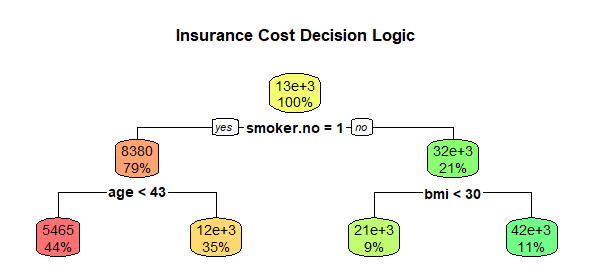
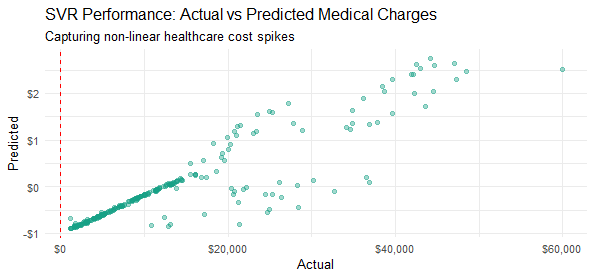

# **Healthcare Actuary Engine (Insurance Cost Prediction)**

## **📌 Business Case**

Predicting individual healthcare expenditure is a high-stakes challenge for insurance providers. Unlike housing prices, medical costs often experience massive "spikes" due to specific lifestyle combinations (e.g., smoking and high BMI).

This project moves beyond linear assumptions to utilize **Non-parametric Models**. These algorithms do not assume a fixed shape for the data, allowing them to capture the complex, non-linear thresholds that define actuarial risk and premium pricing.

-----

## **📂 Data Description**

The model utilizes a medical cost dataset containing 1,338 patient profiles. Key features include:

  * **Charges (Target):** Individual medical costs billed by health insurance.
  * **Age:** Ranging from 18 to 64 years.
  * **BMI (Body Mass Index):** An objective index of body weight ($kg/m^2$) relative to height.
  * **Smoking Status:** A binary categorical variable (Yes/No), which the Decision Tree identified as the primary cost driver.
  * **Children:** Number of dependents covered by health insurance.
  * **Region:** The beneficiary's residential area in the US (Northeast, Southeast, Southwest, Northwest).

-----

## **🛠️ The Machine Learning Pipeline**

To capture the "non-linear" nature of healthcare spikes, I implemented a robust non-parametric workflow:

  * **One-Hot Encoding:** Categorical variables were transformed into dummy variables for mathematical processing.
  * **Feature Scaling:** Applied **Z-score Standardization** (Center & Scale). This was mandatory for the distance-based algorithms (KNN and SVR) to prevent high-magnitude features like "Age" from dominating the model.
  * **Algorithms Evaluated:**
      * **Decision Tree (CART):** Built for maximum interpretability using recursive partitioning.
      * **K-Nearest Neighbors (KNN):** A similarity-based approach tuned for the optimal *k* neighbors.
      * **Support Vector Regression (SVR):** Utilized a **Radial Basis Function (RBF)** kernel to find a non-linear "tube" of best fit.

-----

## **📊 Model Performance Comparison**

The models were evaluated to find the balance between average precision (**MAE**) and total variance explanation (**$R^2$**).

| Model | RMSE | MAE | **$R^2$ (Accuracy)** |
| :--- | :--- | :--- | :--- |
| **SVR (Radial)** | $17,422.09 | $12,983.98 | **0.8192** |
| **Decision Tree** | **$5,252.60\*\* | **$3,340.31** | 0.7963 |
| **KNN** | $17,422.09 | $12,983.96 | 0.7693 |

**Critical Insight:** While **SVR** explained the most variance (82%), the **Decision Tree** was significantly more precise for the average patient, with an error margin of only **$3,340**. This makes the Decision Tree the preferred model for standard premium calculations.

-----

## **📈 Visual Analytics & Logic**

### **1. The Actuary's Flowchart (Decision Tree)**

The tree reveals a clear hierarchy of risk:

  * **The Smoking Filter:** Smoking status is the most significant split. Non-smokers average **$8,380**, while smokers jump immediately to a **$32,000** average.
  * **The BMI Threshold:** For smokers, a BMI over 30 is a "danger zone," with costs skyrocketing to **$42,000**.
  * **The Age Factor:** For non-smokers, age 43 is the tipping point where maintenance costs typically double.

### **2. Capturing Non-Linear Spikes (SVR)**

The SVR plot demonstrates its ability to follow the "upward curve" of medical costs. While most patients cluster at the bottom-left, the model successfully tracks the high-cost outliers at the top-right, which is vital for an insurance firm's long-term financial solvency.

-----

## **🚀 Implementation & Value**

  * **Automated Underwriting:** Replace manual reviews with an AI-driven flowchart that standardizes premium pricing based on objective risk thresholds.
  * **Preventative Outreach:** Identify "High-Risk" segments (Smokers with BMI \> 30) for wellness programs to reduce future claims.
  * **Solvency Forecasting:** Use SVR's high $R^2$ to predict total annual expenditure with 82% confidence.
